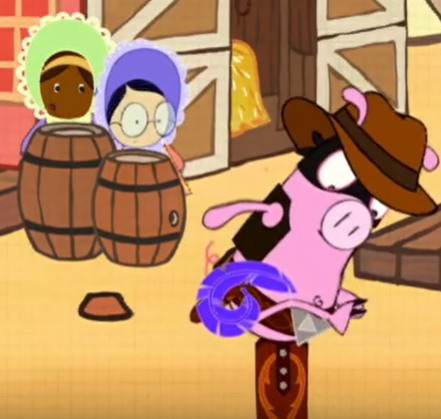

# Acceso a la presentación

##

  

[https://pbeltran.github.io/elemprob1/](https://pbeltran.github.io/elemprob1/)

# ¿Por qué estadística y por qué probabilidad?

## Entre otras cosas...

El poder de los gráficos y de los datos

:::::::::::::: {.columns}

::: {.column width="65%"}

:::

::: {.column width="35%"}

Otra cosa no, pero las elecciones nos traen material de aula de primer orden. 

- _Imágenes de los debates electorales del 28A_
- ¿Qué podemos decir de estas gráficas?

:::
::::::::::::::

## Por ejemplo, una que ha tenido mucho recorrido...

{width=60%}

::: notes
Cuentas de Twitter que analizan gráficos erróneos en los medios o la forma de presentar datos.
\@malaprensa
\@numeroteca
:::

## Casas de apuestas

  

##

  

##

  

##

  

::: notes

Más: prevención de pseudociencias.

:::

## Humor

:::::::::::::: {.columns}

::: {.column width="55%"}

  

[Enlace al vídeo del \#CILE2019](https://www.youtube.com/watch?v=2NDxV3q-fEo)

:::

::: {.column width="45%"}

Marcos Mundstock (_Les Luthiers_) en el VIII Congreso Internacional de la Lengua Española.

No hay varias alternativas, sino solo *una alternativa* con varias *opciones*.

:::
::::::::::::::

::: notes
Les Luthiers siguen proporcionando pequeñas joyas para la educación matemática. Véase, o escúchese, el Teorema de Thales, opus 48... de Johann Sebastian Mastropiero.
:::

## En definitiva

Como el resto de las matemáticas, la estadística y la probabilidad nos permiten participar y disfrutar del mundo en que vivimos.

::: notes

Mejor que mundo, sería decir "sociedad". Estadística, etimología, estado. 

:::

# Somos algoritmos

## Una lectura interesante

:::::::::::::: {.columns}

::: {.column width="35%"}

  
:::

::: {.column width="55%"}

::: incremental

- En su anterior libro, _Sapiens_, Yuval Noah Harari hace una revisión de lo ocurrido hasta ahora.
- En _Homo Deus_ reflexiona sobre el futuro de la humanidad.
- Por ejemplo, aborda el papel de los datos y de cómo razonamos.

:::

:::
::::::::::::::

:::notes
Es historiador.
:::

## Una historia que cuenta Harari...

>Un babuino ve unas bananas que cuelgan de un árbol, pero también se da cuenta de que un león acecha en las inmediaciones. ¿Debería el babuino arriesgar su vida por esas bananas?

. . .

La situación se reduce a un problema matemático de cálculo de probabilidades: la probabilidad de que el babuino muera de hambre si no come las bananas frente a la probabilidad de que el león atrape al babuino.

::: notes

:::

## ¿Cómo resuelve el problema el mono?

El babuino necesita tener en cuenta muchos *datos*: 

:::incremental
- ¿Qué distancia me separa de las bananas? 
- ¿Y del león? 
- ¿A qué velocidad puedo correr? 
- ¿A qué velocidad puede correr el león?
:::

:::notes

Nosotros: de forma inconsciente, como el mono, o consciente.

:::

# ¿Fácil o difícil?

## Un mini estudio estadístico en Desmos

:::::::::::::: {.columns}

::: {.column width="45%"}

 

[Enlace a la actividad](https://student.desmos.com/?prepopulateCode=mbays3)

:::
::: {.column width="45%"}
  
 
 - Continue without signing in.
 - Ignorar mensajes de aviso de pantalla pequeña.
 
:::
::::::::::::::

## Veamos

::: incremental

1. 3050 a.C. - Primeros registros estadísticos.
2. 1650 a.C. - La invención de las fracciones
3. 458 -  La utilización del cero.
4. 1489 - La invención de los signos + y - (J. Widmann).
5. 1492 - El descubrimiento de América (por los europeos)    
6. 1654 - La teoría de la probabilidad (Pascal y Fermat).
7. 1665 - El descubrimiento de la célula (R. Hooke). 
8. 1666 - El descubrimiento de la gravitación universal (I. Newton).
9. 1858 - La teoría de la evolución (C. Darwin).

:::

::: notes

Comentar los resultados sobre teacher.desmos.com

:::

# Algunas orientaciones

## El azar diferencia este tipo de situaciones
:::::::::::::: {.columns}

::: {.column width="35%"}

:::
::: {.column width="55%"}

:::incremental
Como señalan [Batanero y Godino](https://www.ugr.es/~jgodino/edumat-maestros/manual/6_Estocastica.pdf)

- Proporcionar una amplia variedad de experiencias que permitan observar los fenómenos aleatorios y diferenciarlos de los deterministas.
- Estimular la expresión de predicciones sobre el comportamiento de estos fenómenos y los resultados, así como su probabilidad.

:::

:::
::::::::::::::

:::notes

:::

## 

:::incremental
- Organizar la recogida de datos de modo que se puedan contrastar las predicciones con lo obtenido y así los alumnos puedan revisar sus creencias.
- Resaltar el carácter imprevisible de cada resultado aislado, así como la variabilidad de las pequeñas muestras, mediante la comparación de resultados de cada niño o por parejas.
- Ayudar a apreciar el fenómeno de la convergencia mediante la acumulación de resultados de toda la clase y comparar la fiabilidad de pequeñas y grandes muestras.
:::

## No enseñes matemáticas a la manera "inteligente"

_Si eres bueno en mates, es que eres muy inteligente._

Un post de [\@ddmeyer](http://blog.mrmeyer.com/2019/dont-teach-math-the-smart-way/):

{width=60%}

## ¿Por qué no así?

{width=80%}

[Enlace a la actividad de Desmos](https://teacher.desmos.com/polygraph/custom/5c9d3a222ab03627ab029c12)

## ¿Por qué no así? (continuación)

{width=70%}

[Enlace a la actividad de Desmos](https://teacher.desmos.com/activitybuilder/custom/5c915c7f1957670c4053bd4e)

## 

>"Defining _smartness_ narrowly is to define _dumbness_ broadly. Instead, we should seek to find smartness as often as possible in as many students as possible". (@ddmeyer)

## Pero... esto no es nuevo

Hay un consenso en que la resolución de problemas es lo más importante en esto de las matemáticas. Acerca de ello, hay que considerar tres perspectivas:

::: incremental

- Enseñar **para** resolver problemas. 
- Enseñar **a través** de la resolución de problemas. 
- Enseñar **sobre** resolución de problemas. 

:::

. . .

Para indagar un poquito sobre esto: [Gaulin \(2001\)](http://www.hezkuntza.ejgv.euskadi.eus/r43-573/es/contenidos/informacion/dia6_sigma/es_sigma/adjuntos/sigma_19/7_Tendencias_Actuales.pdf)

##

De hecho, también hay consenso en que lo ideal es vertebrar los contenidos a través de la resolución de problemas. English y Gainsburg (2016) se expresan así:

>Hemos descrito un debate de décadas sobre la enseñanza de la resolución de problemas frente a la enseñanza a través de la resolución de problemas. El conocimiento del contenido matemático en sí mismo casi nunca es una demanda explícita por parte de los empresarios. Ahora bien, estos desean trabajadores que sean resolutores eficientes de problemas, lo que implícitamente conduce a los centros educativos a enseñar la resolución de problemas como un fin en sí mismo. 

::: notes

Empresarios, aquí podríamos hablar de lo que es una visión utilitarista y otra más humanista. Pero eso es otra historia.

:::

##

>Por lo tanto, a pesar de la reciente tendencia de la comunidad de educación matemática hacia la resolución de problemas como vehículo para el aprendizaje del contenido matemático, recomendamos cumplir ambos objetivos.

##

>Abogamos por reestructurar este debate para preguntar, en cambio, cómo podemos diseñar problemas que sean lo suficientemente exigentes desde el punto de vista cognitiva, como para fomentar tanto el contenido matemático significativo como las competencias de resolución de problemas. Para empezar, podríamos considerar la redefinición de la resolución de problemas como una experiencia en la que el resolutor o un grupo cooperativo "necesita desarrollar una estrategia matemática más productiva de pensar sobre la situación dada" (Lesh y Zawojewski, 2007, p. 782).

# Experimentación y estimación frecuencial de probabilidades

## 

::: incremental

- Aquí los alumnos experimentan con dispositivos generadores de resultados aleatorios.
- El profesor gestiona los momentos de la recogida de datos, la representación gráfica de los resultados y la discusión o puesta en común. 
- Se trata de animar a los alumnos a expresar sus creencias previas sobre los fenómenos aleatorios y a contrastarlas con los resultados experimentales. 
- Son mini-proyectos estadísticos.

:::

. . .

[Enlace a los materiales de Edumat](https://www.ugr.es/~jgodino/edumat-maestros/)

#  Construcción de dispositivos aleatorios 

## Construcción de dispositivos aleatorios 

:::::::::::::: {.columns}
::: {.column width="65%"}

- Dados, ruletas, etc. con resultados tanto equiprobables como no equiprobables. 

:::incremental
- Distinguir los casos en que es posible o no es posible aplicar el **principio de indiferencia**.
- Apreciar la utilidad de la **estimación frecuencial** de la probabilidad.
- Conexiones intra y extra-curriculares
	* Poliedros regulares y no regulares, desarrollos.
	* Sector circular.
	* Modelado 3D
:::
:::
::: {.column width="30%"}

:::
:::::::::::::

## Con papel, tijeras y pegamento...

Actividad tomada de [Batanero y Godino](https://www.ugr.es/~jgodino/edumat-maestros/manual/6_Estocastica.pdf)

:::::::::::::: {.columns}
::: {.column width="55%"}

1. Construye un dado en cartulina, pero numera dos caras con el cinco y ninguna con el uno.
2. Experimenta con este dado. Enumera, para este caso, el conjunto de todos los resultados posibles. ¿Cuáles son sus probabilidades?

:::

::: {.column width="35%"}

:::

:::::::::::::

:::notes
Actividad tomada de Batanero y Godino (2003)
:::

## Con papel, tijeras y pegamento...

:::incremental

3. Construye otro dado y pega un pequeño peso en la cara del uno (un botón). Así tenemos un dado sesgado.
4. ¿Qué consecuencias tiene el hecho de que una cara del dado pese más que las restantes? En este caso, obtener un 1, ¿es más, menos o igual de probable que antes? ¿Puedes construir un dado sesgado de tal manera que casi siempre salga el 5?

:::

## Con papel, tijeras y pegamento

5. Construye dados sesgados y no sesgados que tengan más de 6 resultados posibles. Construye dados sesgados y no sesgados con poliedros regulares. ¿Cuáles son los poliedros regulares con los que puedes construir dados no sesgados? ¿Podrías construir un dado no sesgado con un poliedro no regular?

. . .

  

:::notes
Actividad tomada de Batanero y Godino (2003)
:::

## ¿Y sin pegamento?

:::::::::::::: {.columns}
::: {.column width="55%"}
- Origami modular.
- Conexión con la geometría.
:::

::: {.column width="35%"}

Módulo Sonobe
:::

:::::::::::::

##

Alumnado de 2º, 3º y 4º de Primaria.

:::::::::::::: {.columns}
::: {.column width="45%"}

:::

::: {.column width="45%"}

:::

:::::::::::::

## Con software de modelado en 3D
 

:::::::::::::: {.columns}
::: {.column width="55%"}
 - Modelado e impresión 3D como recurso didáctico en el aprendizaje de la probabilidad.

:::
::: {.column width="35%"}
{ width=70% }

:::
:::::::::::

## Consigna de la tarea

>La tarea consiste en diseñar un dado con ordenador. Es voluntario y añade 0,5 puntos al examen de geometría. Después, imprimiré en 3D vuestros dados, que os podréis quedar, y os pediré que los probéis para ver si están o no sesgados. 

{ width=70% }

## Tras unos días...
- Plazo de una semana para la entrega de los diseños, recogiendo finalmente las producciones de 10 alumnos. 

Dado con las esquinas redondeadas (forma básica)

## Dado imprimiéndose

- ¿Es este el dado que diseñaste? ¿Te gusta cómo ha quedado?
- ¿Lo usarías para jugar a algún juego de mesa?
- ¿Cómo sabrías si es un buen dado? ¿Hacemos la prueba?

## No es fácil diseñar un dado
**Debates en la comunidad maker**

::: incremental

- Los dados con esquinas más redondeadas, evidentemente, ruedan más. Esto es algo que amplifica cualquier sesgo de diseño, lo que constituye una ventaja de cara a nuestros objetivos.
- Si colocamos el dado para que se imprima girado 45º, obtenemos mejores resultados.
- El porcentaje de relleno de los dados influye. El software traductor permite ahorrar plástico, rellenando el interior de la pieza con un mallado rectangular o hexagonal. Se comprueba que es mejor imprimir dados sólidos al 100%.
:::

. . .

[Ver hilo en thingiverse](http://www.thingiverse.com/thing:147883/#comments)

## Resultados (tipos de errores)

::: incremental

1. Cuando se indican los puntos con cavidades, no se ha retirado la misma cantidad de material en todas las caras, por lo que unas caras pesan más que otras.
2. Un error similar se produce cuando en lugar de retirar material, se añade, con lo que se propicia que se mantenga sobre ciertas caras mayor masa que en otras. 
3. No se tiene en cuenta que la suma de las puntuaciones de las caras debería sumar 7 para facilitar el equilibrado del dado (esto está relacionado con el error de tipo 2), como ocurre en los dados estándar.
4. No se centran o alinean los puntos de cada cara, lo cual influye también en la distribución de masa del dado.
5.  El dado no presenta las mismas dimensiones en todas sus caras. 

:::

## En el máster de ESO (2017/18)

## En la Grecia clásica

## Algo muy simple para resultados no equiprobables

Con un clip y un boli

{ width=60%}

# Juegos y sorteos

## ¿En qué juego pensamos cuando pensamos en probabilidad?

. . .

¿Tal vez este?

{ width=65% }

::: notes

Sistema de turnos.
La vida pasa.

:::

## 

¿O este otro?

##

:::::::::::::: {.columns}
::: {.column width="35%"}

:::

::: {.column width="55%"}

Algunos de estos juegos contribuyen a la formación de creencias, como, por ejemplo, que el número cinco es el más difícil, cuando se lanza un dado. Todas estas actividades se podrían aprovechar en relación con
la introducción de la probabilidad

:::

:::::::::::::

## Una propuesta para infantil

## El frutal (Obstgarten)

{ width=62% }

Beltrán-Pellicer, P. (2017). Una propuesta sobre probabilidad en educación infantil con juegos de mesa. _EDMA0-6, 6_(1), 53-61. [Enlace.](http://www.edma0-6.es/index.php/edma0-6/article/view/25/22)

##

:::::::::::::: {.columns}
::: {.column width="65%"}

:::

::: {.column width="30%"}

- Cooperativo.
- Conteo.
- Colores.
- Turnos.
- Probabilidad.

:::

:::::::::::::

##

:::::::::::::: {.columns}
::: {.column width="35%"}

{ width=80% }

:::

::: {.column width="65%"}

1. Azul: el jugador coge una ciruela.
2. Verde: el jugador coge una manzana.
3. Rojo: se coge una cereza.
4. Amarillo: se coge una pera.
5. Cesta: es el premio gordo, se pueden coger dos piezas de fruta *a elegir*.
6. Cuervo: lo peor de lo peor. Se coloca una pieza del puzle central, que tiene 9. 

:::

:::::::::::::

## Un juego de mayores

Infantil y primaria

{ width=80% }

## Lo hemos visto en...

The Big Bang Theory

{ width=80% }

## Catán junior

Infantil y primaria

{ width=30% }

Gana el jugador que primero construye todas sus guaridas y, para ello, hay que ir aumentando también la flota de barcos y así poder abrir nuevas rutas.

##

::: incremental

- En cada turno, se lanza el dado, y en función de lo que salga te tocan unos recursos (oro, sable, madera, oveja o piña) o aparece en escena el pirata rapaz.
- Siempre puede cambiarse, una sola vez por turno, una ficha de recurso por una de los salvavidas.
- Siempre pueden cambiarse, las veces que se deseen, dos fichas de recurso por una de la reserva general.
- En cada turno se construye lo que se desee (guarida o barco) o se pide ayuda al loro Coco, las veces que se quiera. Pedir ayuda al loro significa que se consigue una ficha de Coco, que viene con sorpresa (recursos o mover al pirata rapaz).
- El que más fichas de Coco tenga, pone una guarida sin coste en el centro del tablero. Si alguien consigue más fichas, esa guarida se cambia. Y si hay dos jugadores con el mismo número de fichas, no se pone guarida.

:::

## 

{ width=80% }

## 

:::::::::::::: {.columns}
::: {.column width="45%"}

{ width=95% }

:::

::: {.column width="45%"}

{ width=95% }
:::

:::::::::::::

Ampliación de todo esto... [Enlace a mi blog.](http://www.tierradenumeros.com/2017/04/catan-junior-juego-de-mesa.html)

## Leyendas de Andor

- Primaria en adelante. 
- Toma de decisiones en situaciones de incertidumbre.
- Cooperativo. Mucha conversación para decidir qué hacer.

{ width=50% }

## 

{ width=80% }

## 

{ width=80% }

## Colt Express

Primaria en adelante.

{ width=80% }

## Colt Express

Pensamiento computacional y toma de decisiones en el Far West.

{ width=80% }

## Adaptaciones

Tabú o juego de las palabras prohibidas.

{ width=80% }

Beltrán-Pellicer, P., Ricart, M., & Estrada, A. (2019). Una experiencia sobre el diseño de juegos como recurso para desarrollar la competencia didáctico-matemática en probabilidad con docentes de infantil y primaria. _Tercer Congreso Internacional Virtual de Educación Estadística_ (pp. 1-10). [Enlace](https://www.researchgate.net/publication/331435985_Una_experiencia_sobre_el_diseno_de_juegos_como_recurso_para_desarrollar_la_competencia_didactico-matematica_en_probabilidad_con_docentes_de_infantil_y_primaria)

##

Se planteó el diseño o adaptación de un juego como experiencia formativa.

{ width=50% }

Producción de las participantes del Máster (2017/18).

## Mini-juegos

[Beano](http://web.mit.edu/mitstep/sites/default/files/Beano.pdf)

:::::::::::::: {.columns}
::: {.column width="45%"}

{ width=95% }

:::

::: {.column width="45%"}

{ width=95% }
:::

:::::::::::::

::: notes

Batanero en alguno de sus artículos menciona un juego similar, que consiste en alcanzar la orilla contraria. Gana el que pasa todas sus fichas.

:::

# Dibujos animados

## El problema del mediodía

:::::::::::::: {.columns}
::: {.column width="55%"}

[Peg+Gato](http://www.rtve.es/infantil/series/peggato/)
:::

::: {.column width="45%"}

Edades 5-7 años (aprox).

- Tiempo (mediodía).
- Probabilidad: duelo con Jack «el Malo»

:::

:::::::::::::

::: notes
Botas cortas: pluma corta.
Botas altas: pluma larga para llegar a su tripa.
Peg hace una pequeña investigación
:::

## Recuento 

Miniproyecto estadístico para la toma de una decisión.

## Predicción correcta... ¿o no?

## Cyberchase

:::::::::::::: {.columns}
::: {.column width="55%"}

:::

::: {.column width="45%"}

- _Ayudar a los indecisos..._
- Más orientado a primaria y primer ciclo de ESO.

:::

:::::::::::::

## Juego justo

[Cyberchase 1x03 "Ciudad justa"](https://www.youtube.com/watch?v=iw-6fUT8iC4)

{ width=60% }

# Recursos en Internet

## Simuladores de experimentos

[Laboratorio básico de Azar, Probabilidad y Combinatoria](http://ntic.educacion.es/w3/eos/MaterialesEducativos/mem2010/labazar/index.html)
 
 {width=60%}

## Desmos

[Chance experiments](https://teacher.desmos.com/activitybuilder/custom/59233c9aefd17610dbbd684e)

{width=80%}

# Para terminar

## Esto va de oportunidades de aprendizaje

{width=80%}

::: notes
Algo no le cuadra...

:::

##

{width=80%}

Fin de la presentación.

# Créditos y referencias

## Lista de referencias

Alsina, Á., & Salgado, M. (2019). Ampliando los conocimientos matemáticos en Educación Infantil: la incorporación de la probabilidad. _Revista de Estudios y Experiencias En Educación, 18_(36), 225–240. [Enlace.](https://doi.org/10.21703/rexe.20191836alsina6)

Batanero, C., & Díaz, C. (2011). _Estadística con proyectos_. Granada: Universidad de Granada. [Enlace.](https://www.ugr.es/~batanero/pages/ARTICULOS/Libroproyectos.pdf)

Batanero, C., & Godino, J. D. (2003). _Estocástica y su didáctica para maestros_. Departamento de Didáctica de las Matemáticas. Universidad de Granada. [Enlace.](https://www.ugr.es/~jgodino/edumat-maestros/manual/6_Estocastica.pdf)

Beltrán-Pellicer, P. (2017). Modelado e impresión 3D como recurso didáctico en el aprendizaje de la probabilidad. _Épsilon: Revista de Educación Matemática, 34_(95), 99-106. [Enlace.](http://thales.cica.es/epsilon/sites/thales.cica.es.epsilon/files/epsilon95_6.pdf)

##

Beltrán-Pellicer, P. (2017). Una propuesta sobre probabilidad en educación infantil con juegos de mesa. _EDMA0-6: Educación Matemática en la Infancia, 6_(1), 53-61. [Enlace.](http://www.edma0-6.es/index.php/edma0-6/article/view/25/22)

Beltrán-Pellicer, P., Ricart, M., & Estrada, A. (2019). Una experiencia sobre el diseño de juegos como recurso para desarrollar la competencia didáctico-matemática en probabilidad con docentes de infantil y primaria. En J. M. Contreras, M. M. Gea, M. M. López-Martín, & E. Molina-Portillo (Eds.) _Actas del Tercer Congreso Internacional Virtual de Educación Estadística_ (pp. 1-10). [Enlace](https://www.researchgate.net/publication/331435985_Una_experiencia_sobre_el_diseno_de_juegos_como_recurso_para_desarrollar_la_competencia_didactico-matematica_en_probabilidad_con_docentes_de_infantil_y_primaria)

Godino, J. D., Batanero, C., & Cañizares, M. J. (1987). _Azar y probabilidad_. Madrid: Síntesis. 

##
English, L. D., & Gainsburg, J. (2016). Problem Solving in a 21st-Century Mathematics Curriculum. En L.D. English, & D. Kirshner, _Handbook of international research in mathematics education_ (p. 326). New York: Routledge.

Vásquez, C., & Alsina, A. (2019). Conocimiento especializado del profesorado de educación básica para la enseñanza de la probabilidad. _Profesorado, Revista de Currículum y Formación Del Profesorado, 23_(1), 393-419. [Enlace.](https://doi.org/10.30827/profesorado.v23i1.9160)

## Créditos

_Compartir el conocimiento de forma libre es una buena práctica._

En estas diapositivas se han utilizado materiales disponibles en abierto y se han citado las fuentes correspondientes. El contenido de la presentación está publicado con licencia Creative Common [CC-BY-SA-4.0](https://creativecommons.org/licenses/by-sa/4.0/legalcode.es), lo que quiere decir que puedes compartirla y adaptarla, citándome (Pablo Beltrán-Pellicer) y poniendo un enlace a [https://pbeltran.github.io/2019iceudl](https://pbeltran.github.io/2019iceudl). 

_Siéntete libre de trabajar con este material y de contactar conmigo para compartir tus reflexiones._

##

Presentación realizada con  <a href="https://revealjs.com/#/">Reveal.js</a>, <a href="https://pandoc.org/">Pandoc</a>, <a href="https://www.mathjax.org/">MathJax</a> y <a href="https://www.markdownguide.org/">Markdown</a>.

Las imágenes son propias o de dominio público, salvo las que se ha citado la fuente en su diapositiva.
 

